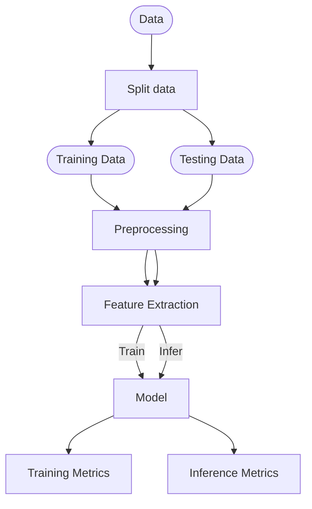

# Pipeline

```mermaid
flowchart
    Data([Data]) --> Split[Split data]

    Split --> Train([Training Data])

    Split --> Test([Testing Data])

    Train & Test --> Preprocessing

    Preprocessing & Preprocessing --> FeatureExtraction[Feature Extraction]

    Model[Model]
    
    FeatureExtraction -- Train --> Model

    FeatureExtraction -- Infer --> Model

    Model --> TrMetrics[Training Metrics]

    Model --> TeMetrics[Inference Metrics]

```